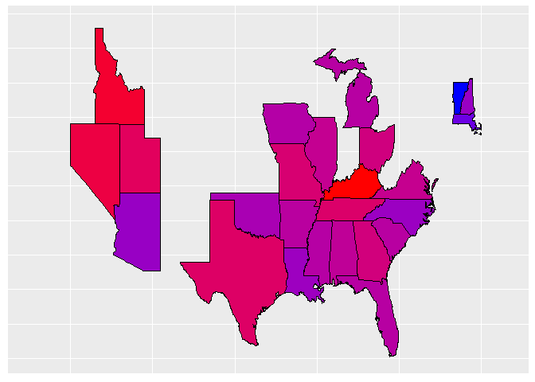
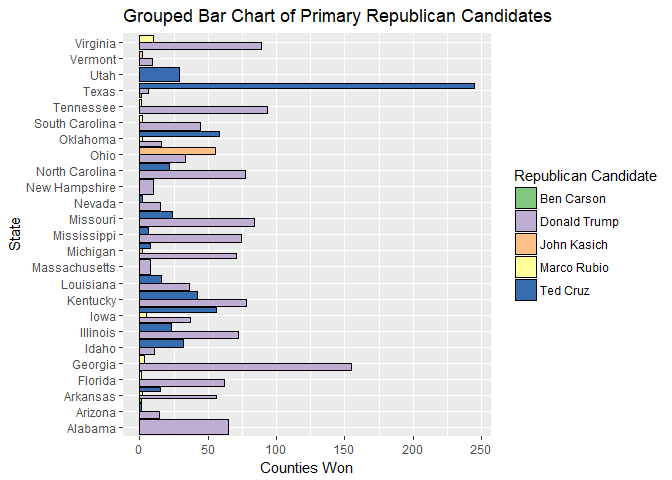
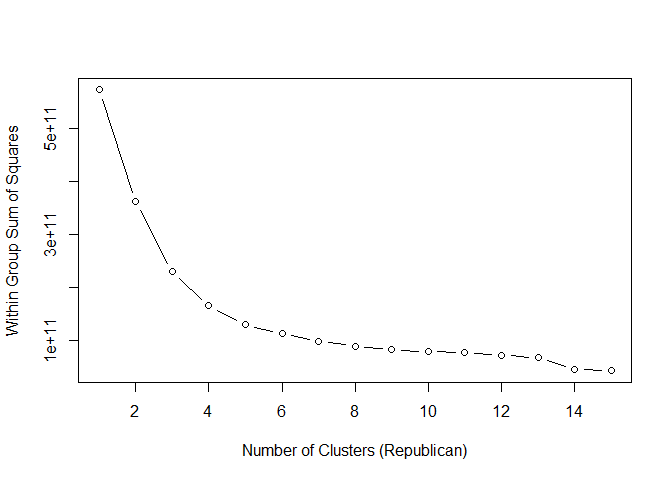
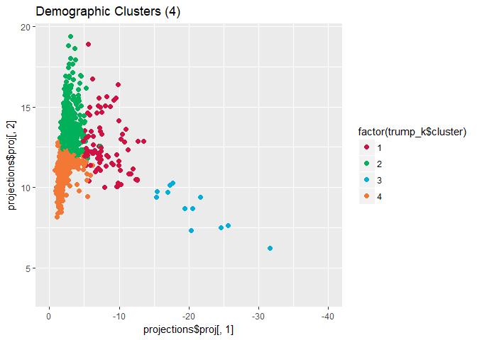
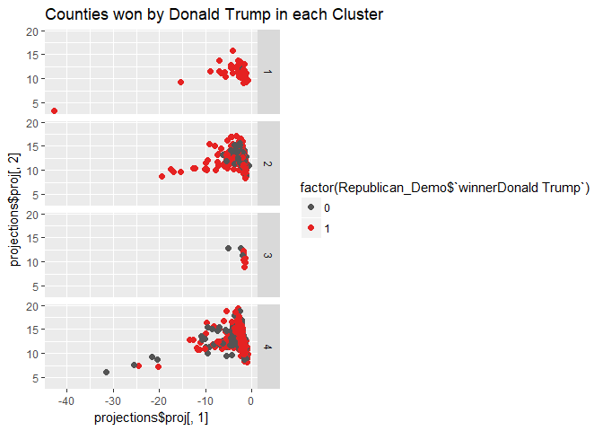

# Trump Voters Demographic Clusters


#####This is an R Markdown document. 

The purpose of this project was to attempt to cluster demographic and socio-economic data of Donald Trump supporters. The data contains results from primary races as of March 2016, which is the reason why every state is not represented. 


Here, we can see how many candidates received at least one vote, and that the dataset only contains votes for candidates whose party is either republican or democrat.

```r
unique(results$candidate)
```

```
##  [1] Donald Trump    Ted Cruz        Marco Rubio     Ben Carson     
##  [5] John Kasich     Hillary Clinton Bernie Sanders  Carly Fiorina  
##  [9] Rand Paul       Mike Huckabee   Rick Santorum   Jeb Bush       
## [13] Chris Christie  Martin O'Malley  Uncommitted     No Preference 
## 16 Levels:  No Preference  Uncommitted Ben Carson ... Ted Cruz
```

```r
unique(results$party)
```

```
## [1] Republican Democrat  
## Levels: Democrat Republican
```

####Creating a dataset based on the ratio of votes.  
Using the package sqldf allows the use of SQL syntax to be used in an R environment, most have experience in SQL and find it easier than R. The package, just like SQL, enables the use of grouping by one or more variables. Here, I create a new dataset that first sums _fractionVotes_, the share of votes received regardless of party affiliation, and then group the results by _fips_ and _party_. _fips_ is the Federal Information Processing Standards (FIPS) code which uniquely identifies counties. Next, I averaged those ratios across each _state_.

```r
library(sqldf)
partyRatio <- sqldf("select state, state_abbreviation, fips, party, 
                    sum(fractionVotes) as ratio from results group by fips, party")
partyRatio <- sqldf("select state, state_abbreviation, party, avg(ratio) as republican_ratio
                    from partyRatio group by state, party")
partyRatio <- subset(partyRatio, partyRatio$party=="Republican")
```

Using the package ggplot2 and the dataset made above, we can now create a choropleth map based on the ratio of votes. Notice the colors, red for republican and blue for democrat, we can see how contested, or non-contested, each state is. A color of purple indicates a divided state, and the more pronounced a party's colors the higher the ratio.
<!-- -->

####Creating a dataset of counties won by each Republican candidate  
Next we will create a dataset that only contains Republican candidates and make a new feature _winner_ that identifies which candidate won that county via highest _fractionVotes_ received. The stateCount datset is used to build the bar chart below, _countieswon_ is just the count of _winner_ per state and candidate.

```r
library(sqldf)
library(dplyr)
republican_results <- subset(results, results$party == "Republican")
countyWinner <- republican_results %>% group_by(state,fips)
countyWinner <- summarize(countyWinner, winner=candidate[which.max(fractionVotes)])
countyWinner$winner <- factor(countyWinner$winner)
stateCount <- sqldf("select state, winner, count(winner) as 
                    countieswon from countyWinner group by state, winner")
```

<!-- -->

####Demographic Clusters  

Subsetting county demographics by only keeping relevant variables. To make it easier for future, and current, analysis the variables were renamed according to what they are describing in the codebook. Also, below two datasets are joined together. I filtered out every candidate except for Donald Trump or Ted Cruz. The dataset, where it is now, was used for some other analysis not present in this document. Eventually, a dummy variable is created to indicate whether Donald Trump won a particular county or not. 

```r
library(dplyr)
demographics <- subset(county_demo, select=c("fips", "area_name", "AGE295214", "AGE775214", "SEX255214",                                                    "RHI125214", "RHI225214", "RHI325214", "RHI425214",                                                            "RHI525214", "RHI725214", "POP645213", "EDU635213",                                                            "EDU685213", "VET605213", "HSG445213", "INC910213",                                                            "INC110213", "PVY020213", "POP060210"))
colnames(demographics)[3:20] <- c("Young_Citizens", "Old_Citizens", "Female_Percent",
                                  "White_Percent", "AfricanAmerican_Percent", "AmericanIndian_Percent",
                                  "Asians_Percent", "HawaiianPacific_Percent", "HispanicLatino_Percent", 
                                  "ForeignBorn_Percent","HighSchoolGrad_Percent","BachDegreeHigher_Percent",
                                  "Veterans", "HomeOwner_Rate", "PerCapitaIncome", "MedianHouseholdInc", 
                                  "PovertyLevel_Percent", "Population_Density")
#Join countyWinner and demographics data by an inner join
Republican_Demo <- inner_join(countyWinner, demographics, by="fips")
#filter out results that are not Donald Trump or Ted Cruz
Republican_Demo <- Republican_Demo %>% filter(winner=="Donald Trump" | 
                                              winner=="Ted Cruz")
#Drop irrelevant variables
Republican_Demo <- Republican_Demo[-c(1, 2, 4)]

#Create dummy variables for the winner variable
Republican_Demo$winner <- factor(Republican_Demo$winner)
dummy <- model.matrix(~winner-1, data=Republican_Demo)
joined <- cbind(Republican_Demo[match(rownames(dummy), rownames(Republican_Demo)),], dummy)
Republican_Demo <- subset(joined, select=-c(winner))
```

####Just how many clusters?  
To determine _k_, I frequently use what is commonly referred to as the "elbow" method. Take a look at the plot below, is there anything that stands out, perhaps a bend, or an elbow? When I look at this line graph I say the bend takes place at 4, what do you think?  

<!-- -->

####Running the k-means algorithm

```r
library(fpc)
trump_k <- kmeans(Republican_Demo, centers=4,iter.max=1000,algorithm="MacQueen")
trump_k$size
```

```
## [1]  547   13 1151   83
```

```r
trump_k$withinss
```

```
## [1] 54016346164 33269580971 49653455164 28713489206
```

```r
as.data.frame(aggregate(Republican_Demo, by=list(cluster=trump_k$cluster), FUN=mean))
```

```
##   cluster Young_Citizens Old_Citizens Female_Percent White_Percent
## 1       1       23.24186     16.71207       49.95960      88.51298
## 2       2       23.56923     14.30000       51.08462      73.63077
## 3       3       22.46699     18.08758       49.97498      80.63067
## 4       4       23.02771     15.28916       50.89759      77.50482
##   AfricanAmerican_Percent AmericanIndian_Percent Asians_Percent
## 1                 7.41298              1.0458867       1.163071
## 2                18.00000              1.1923077       4.592308
## 3                15.28123              1.6771503       0.657689
## 4                15.44337              0.9012048       3.571084
##   HawaiianPacific_Percent HispanicLatino_Percent ForeignBorn_Percent
## 1              0.09616088               9.954113            4.587569
## 2              0.18461538              27.900000           17.276923
## 3              0.07506516               8.470895            3.355430
## 4              0.16867470              13.474699            9.601205
##   HighSchoolGrad_Percent BachDegreeHigher_Percent   Veterans
## 1               86.64168                 21.94004   4717.366
## 2               84.90000                 27.80769 126535.154
## 3               79.44648                 14.46560   2543.768
## 4               88.37952                 29.38554  35968.337
##   HomeOwner_Rate PerCapitaIncome MedianHouseholdInc PovertyLevel_Percent
## 1       74.71188        25996.28           53154.21             12.66380
## 2       61.57692        27069.31           50016.46             17.11538
## 3       72.38836        19492.36           36947.75             21.51703
## 4       67.31566        27933.35           54815.96             14.28193
##   Population_Density winnerDonald Trump winnerTed Cruz
## 1          119.11207          0.5319927      0.4680073
## 2         1549.45385          0.6923077      0.3076923
## 3           62.77706          0.7428323      0.2571677
## 4          779.41687          0.7228916      0.2771084
```

```r
projections <- discrproj(Republican_Demo, trump_k$cluster)
Republican_Demo$clustname <- trump_k$cluster
Republican_Demo$clustname <- factor(Republican_Demo$clustname)
```

####Plotting the 4 clusters
<!-- -->

####Counties won in each cluster by Donald Trump
<!-- -->

####Findings and Interpretations  
While clustering is extremely useful, the output can be hard to interpret. Initially we have
no clue as to what these clusters mean or what they represent. Just look at the plot above,
yes it is certainly pretty and nice to look at it but what does it mean? To help with this
problem I will look at the mean of all the variables in each cluster and try to define what
each cluster is. Looking at the means of each cluster it becomes clear that there are
differences among them, for example the median household income is much higher in the
"Rising Prosperity" cluster than the "Rural" cluster; same goes go for poverty percentage
as well.

Below is a breakdown of the 4 clusters identified:  

**Metropolitan**: 1% of the counties fall into this cluster. This cluster has the largest
percentages of young voters and African Americans Asian, and Hispanic ethnicities; as
well as the highest percentage of foreign-born persons. This cluster also has a high
poverty rate, 17%, and the lowest homeowner rate, 61.5%. Unsurprisingly, boasting the
highest population density too. Donald Trump has won nearly 70% of the counties in the
cluster.  

**Urban**: 5% of the counties fall into this cluster. They have a good mixed proportion of
the White, African American, Asian, and Hispanic ethnicities, as well as foreign-born
voters. This cluster is where you will find the highest educated and wealthiest citizens
(median household income, ~$55,000) in the dataset. Donald Trump has won 72% of the
counties in the cluster.  

**Rising Prosperity**: 30% of the counties in the analysis fall into this cluster. This cluster
maintains the highest percentage of white persons and low or lowest percentages of
African Americans, Asians, and Hispanic persons. The homeowner rate is also the
highest in this cluster than the others, while also having a high median household income
and a low poverty rate. Donald Trump has his lowest winning percentage in this cluster,
only winning 53% of the counties in this cluster.  

**Rural**: 64% of the counties in the analysis fall into this cluster. This is the largest cluster
and contains a high percentage of White and African American persons. The ethnicities
with the lowest percentage are Hispanics and Asians, as well as the lowest foreign born
percentage. Other characteristics of the cluster include the least educated, lowest median
income, ~$37,000, and highest poverty level, 21.5%. This cluster has the highest
percentage of Native Americans, 1.67%. Donald Trump has his highest winning
percentage in this cluster, winning 74% of the counties in this cluster.  
